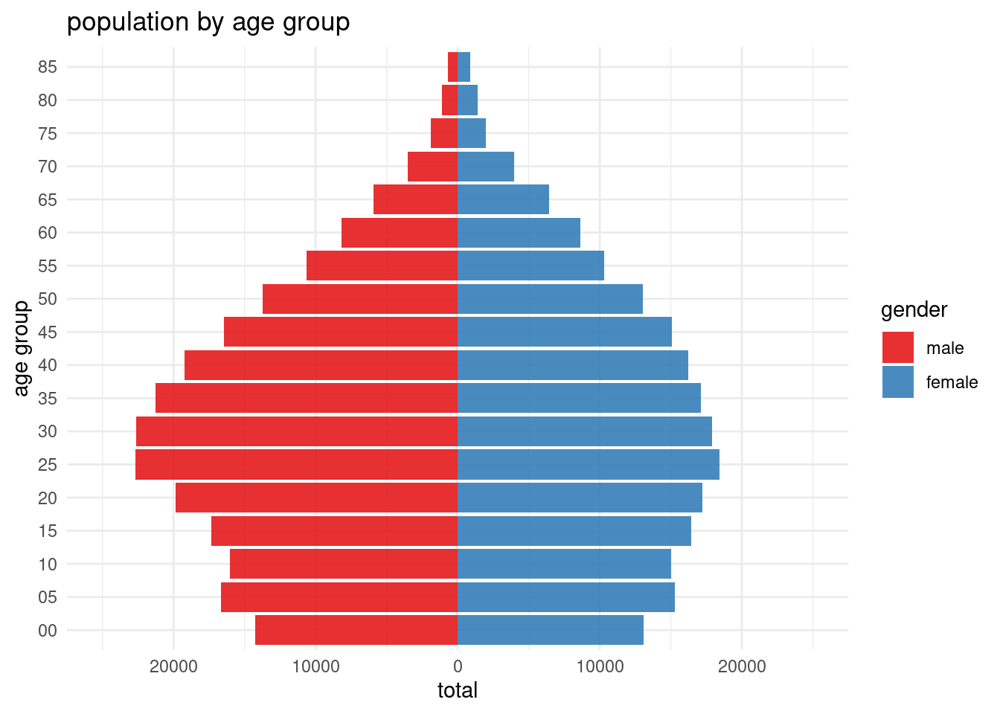
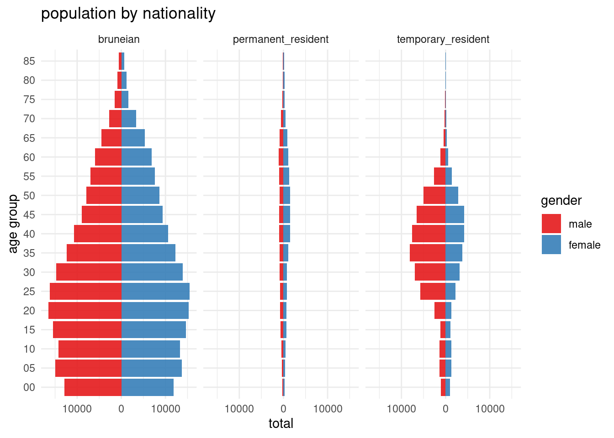
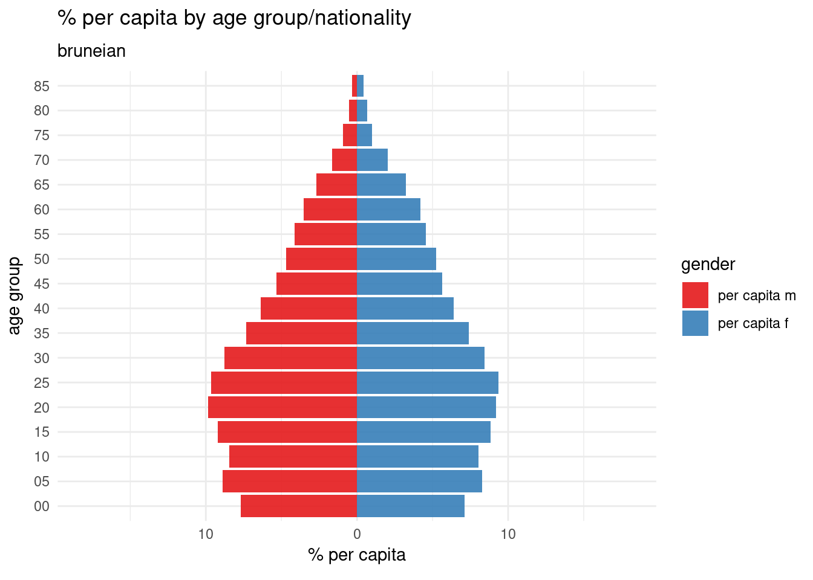

Last week, I found myself back in Brunei—not for the usual family visit, but for a bunch of work meetings and a talk on data science.

It was a blink-and-you-miss-it trip; barely three days on the ground.

In true Bruneian fashion, we spent the time between meetings and talks dining out. By our fourth restaurant visit, my colleague Thomas—a Kiwi and a first-timer in Brunei—asked in the most hilariously earnest way: "Why aren't there any locals running their own businesses?"

Honestly, I didn’t know. I spent most of my first 18 years here, and it’s always been like this. I knew we had a population of around half a million, but that’s all I could tell him.

### libraries

Main libraries in code block.


::: {.cell}

```{.r .cell-code}
library(librarian)
shelf(readxl, tidyverse, reshape2)
```
:::


# data

That was the inspiration for this post.

I managed to collate and convert the terrible .pdf from the Department of Statistics into some usable tables. If anyone stumbles upon this blog, they might want to recreate this.

The main data sets I compiled include the age group by nationality table (BN_age_group_nationality.xlsx in this post's repo) from the published 2021 national census.

The main data structure is pretty simple:

1.  `age_group`: Mostly in 5-year divisions, top-coded at 85+

2.  `type`: Categorical options include total, Bruneian, permanent_resident, and temporary_resident

3.  `male`: Total number of males

4.  `female`: Total number of females


::: {.cell}

```{.r .cell-code}
# main data structure
read_xlsx("BN_age_group_nationality.xlsx") %>% 
  str()
```

::: {.cell-output .cell-output-stdout}

```
tibble [72 × 4] (S3: tbl_df/tbl/data.frame)
 $ age_group: chr [1:72] "00-04" "05-09" "10-14" "15-19" ...
 $ type     : chr [1:72] "total" "total" "total" "total" ...
 $ male     : num [1:72] 14258 16658 16051 17365 19870 ...
 $ female   : num [1:72] 13097 15276 15036 16425 17229 ...
```


:::
:::


## processing

The only real processing we need to do is to get the lower age limit for each of the age groups within the dataset. That's relatively simple with the following code:


::: {.cell}

```{.r .cell-code}
# read as age_group object
age_group <- read_xlsx("BN_age_group_nationality.xlsx")

# get first two characters from column
age_group <- age_group %>%
  mutate(lower_age = substr(age_group, 1, 2)) %>% 
  # reposition to second column
  relocate(lower_age, .before = age_group)

# final dataset
age_group
```

::: {.cell-output .cell-output-stdout}

```
# A tibble: 72 × 5
   lower_age age_group type   male female
   <chr>     <chr>     <chr> <dbl>  <dbl>
 1 00        00-04     total 14258  13097
 2 05        05-09     total 16658  15276
 3 10        10-14     total 16051  15036
 4 15        15-19     total 17365  16425
 5 20        20-24     total 19870  17229
 6 25        25-29     total 22698  18408
 7 30        30-34     total 22630  17904
 8 35        35-39     total 21289  17136
 9 40        40-44     total 19231  16232
10 45        45-49     total 16463  15079
# ℹ 62 more rows
```


:::
:::


This code snippet loads the dataset, extracts the lower age limit from the age group, and adds it as a new column in the dataframe.

# pyramids

To get a better sense of our population in 2021, we'll create three charts:

1.  Population by age group for the differences between male and female populations.

2.  Faceted pyramid by nationality for structure variation among Bruneians, permanent residents, and temporary residents.

3.  Gender and age group per residential capita for subgroup contribution to the overall population.

## population by age group

In the grand scheme of things, men outnumber women in Brunei by around 11.4%. What's particularly interesting is the noticeable bulge in the 20-45 age range for men. In this subset, men outnumber women by an average of about 21.5%, compared to the overall average difference per age group of around 4.6%.


::: {.cell}

```{.r .cell-code}
# total population by age group
age_group %>%
  filter(type == "total") %>% 
  # melt for male and female
  melt(value.name = "total",
       variable.name = "gender") %>%
  # plot
  ggplot(aes(fill = gender, 
             x = lower_age, 
             y = ifelse(
               test = gender == "male",
               # flip the values to the negative
               yes = -total,
               no = total),
             )) +
         geom_col(alpha = 0.9) +
  # flip the y-axis
  coord_flip() +
  scale_y_continuous(
    labels = abs, # set as absolute to remove negative sign
    limits = c(-25000, 25000) # set limits aesthetics
    ) +
  labs(
    x = "age group",
    y = "total",
    title = "population by age group"
  ) + # change color with brewer
  scale_fill_brewer(palette = "Set1") +
  theme_minimal()
```

::: {.cell-output-display}
{width=672}
:::
:::


## age groups by nationality

This is where the real issue becomes clear. Our local population is relatively young, and it seems we are compensating for the shortage of young Bruneians with temporary residents.


::: {.cell}

```{.r .cell-code}
# total population by age group
age_group %>%
  #filter out total
  filter(type != "total") %>%
  # melt for male and female
  melt(
    value.name = "total",
    variable.name = "gender") %>%
  # plot
  ggplot(aes(fill = gender, 
             x = lower_age, 
             y = ifelse(
               test = gender == "male",
               # flip the values to the negative
               yes = -total,
               no = total),
             )) +
         geom_col(alpha = 0.9) +
  # flip the y-axis
  coord_flip() +
  scale_y_continuous(
    labels = abs, # set as absolute to remove negative sign
    # limits = c(-30000, 30000) # set limits aesthetics
    ) +
  labs(
    x = "age group",
    y = "total",
    title = "population by nationality"
  ) + # change color with brewer
  scale_fill_brewer(palette = "Set1") +
  facet_wrap(~type) +
  theme_minimal()
```

::: {.cell-output-display}
{width=672}
:::
:::


Temporary residents make up a significant proportion of the general population, constituting up to 34.4% across both genders.


::: {.cell}

```{.r .cell-code}
age_group %>% 
  filter(type != "total") %>%
  melt(value.name = "total",
       variable.name = "gender") %>% 
  # filter(age_group %in% c("20-24", "25-29", "30-34", "35-39", "40-44")) %>% 
  group_by(age_group, type) %>%
  summarise(total = sum(total)) %>% 
  # pivot wider
  pivot_wider(names_from = type, values_from = total) %>% 
  mutate(total = bruneian + permanent_resident + temporary_resident) %>% 
  # percentage of total
  mutate(
    bruneian = bruneian/total * 100,
    permanent_resident = permanent_resident/total * 100,
    temporary_resident = temporary_resident/total * 100) %>% 
  select(-total)
```

::: {.cell-output .cell-output-stdout}

```
# A tibble: 18 × 4
# Groups:   age_group [18]
   age_group bruneian permanent_resident temporary_resident
   <chr>        <dbl>              <dbl>              <dbl>
 1 00-04         90.4               1.94               7.63
 2 05-09         89.6               2.07               8.37
 3 10-14         88.6               2.99               8.38
 4 15-19         89.1               4.10               6.76
 5 20-24         85.7               3.98              10.3 
 6 25-29         77.1               3.73              19.2 
 7 30-34         70.9               3.93              25.2 
 8 35-39         64.0               5.02              31.0 
 9 40-44         60.0               6.80              33.2 
10 45-49         57.9               7.65              34.4 
11 50-54         61.9               8.91              29.2 
12 55-59         69.3              11.2               19.5 
13 60-64         76.6              13.1               10.3 
14 65-69         79.7              14.0                6.29
15 70-74         81.3              13.9                4.78
16 75-79         80.7              14.8                4.51
17 80-84         80.5              15.5                4   
18 85+           78.7              18.0                3.28
```


:::
:::


Among men aged 20 to 49, this percentage can reach as high as 40% in certain age groups.


::: {.cell}

```{.r .cell-code}
age_group %>% 
  filter(type != "total") %>%
  melt(value.name = "total",
       variable.name = "gender") %>% 
  filter(age_group %in% c("20-24", 
                          "25-29", 
                          "30-34", 
                          "35-39", 
                          "40-44", 
                          "45-49")) %>% 
  group_by(age_group, type, gender) %>%
  filter(gender == "male") %>% 
  summarise(total = sum(total)) %>% 
  # pivot wider
  pivot_wider(names_from = type, values_from = total) %>% 
  mutate(total = bruneian + permanent_resident + temporary_resident) %>% 
  # percentage of total
  mutate(
    bruneian = bruneian/total * 100,
    permanent_resident = permanent_resident/total * 100,
    temporary_resident = temporary_resident/total * 100) %>% 
  select(-total)
```

::: {.cell-output .cell-output-stdout}

```
# A tibble: 6 × 5
# Groups:   age_group [6]
  age_group gender bruneian permanent_resident temporary_resident
  <chr>     <fct>     <dbl>              <dbl>              <dbl>
1 20-24     male       83.3               3.89               12.8
2 25-29     male       71.4               3.44               25.1
3 30-34     male       65.3               3.72               31.0
4 35-39     male       58.0               3.97               38.0
5 40-44     male       55.6               4.89               39.5
6 45-49     male       54.2               5.67               40.1
```


:::
:::


## Gender and age group per residential capita

The proportion of temporary residents in the 20-45 age group is pretty huge, with over 70% of them falling into this range.

I think the current distribution really shows how important temporary workers are to our economy and the labour gaps we're facing. Most of these immigrants are in the 20-45 age range, which makes you wonder if we should let them stay on as permanent residents or even citizens, especially since they've contributed so much to nation-building during the prime of their working lives. Are we ready for this, and will they fit in a way that feels right to Bruneians? Plus, how will our migration policies change as our young Bruneian population ages and starts to fill these age groups and labour roles?


::: {.cell}

```{.r .cell-code}
shelf(gganimate, png, gifski)

pop_pyr <- age_group %>% 
  filter(type != "total") %>% 
  group_by(type) %>%
  mutate(total_m = sum(male),
         total_f = sum(female),
         `per capita m` = (male/total_m) *  100,
         `per capita f` = (female/total_f) *  100) %>%
  select(-male, -female, -total_m, -total_f) %>% 
  melt(variable.name = "gender",
       value.name = "total") %>% 
  ggplot(aes(fill = gender, 
             x = lower_age, 
             y = ifelse(
               test = gender == "per capita m",
               # flip the values to the negative
               yes = -total,
               no = total),
             )) +
  geom_col(alpha = 0.9) +
  coord_flip() +
  scale_y_continuous(
    labels = abs, # set as absolute to remove negative sign
    limits = c(-18, 18) # set limits aesthetics
    ) +
  labs(
    x = "age group",
    y = "% per capita",
    title = "% per capita by age group/nationality",
    subtitle = "{next_state}"
  )  + 
  scale_fill_brewer(palette = "Set1") +
  theme_minimal() + # animate
  transition_states(type, transition_length = 1, state_length = 1)
  
pop_pyr
```

::: {.cell-output-display}

:::
:::


Going back to the original question: why aren't there more locals running their own businesses? Maybe Thomas was only seeing part of the picture. It’s hard to say since there are so many factors at play. It could be a mix of having a young local population and a cultural aversion to front-facing or physical labour roles. Maybe Bruneian business owners don't even want to hire locals or can't pay local wages, which is an even bigger issue.

It would be interesting to find out exactly where these temporary residents are working—especially the men. What industries are they in, and are they taking on roles that the local (mostly male) workforce can't handle?

